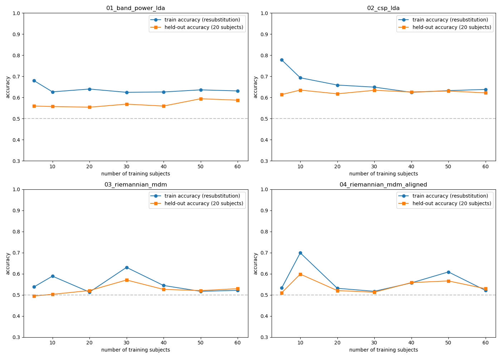

# EEG Motor Imagery Classification (Left vs Right Fist)

Binary classification of left vs. right fist motor imagery from EEG, using
80 subjects from the PhysioNet EEG Motor Movement/Imagery Dataset, evaluated
with leave-one-subject-out (LOSO) cross-validation.

80 subjects (1–80) were used for training and LOSO evaluation. Subjects
81+ were held out, for use as
independent validation. 

## Dataset

**EEG Motor Movement/Imagery Dataset** — https://physionet.org/content/eegmmidb/1.0.0/

Over 1500 one- and two-minute EEG recordings from 109 volunteers, 64-channel
EEG recorded with the BCI2000 system. Each subject completed 14 runs; this
project uses only the imagined-movement runs:

- Runs 1, 2 — baseline (eyes open / eyes closed)
- Runs 3, 7, 11 — executed left/right fist
- **Runs 4, 8, 12 — imagined left/right fist (used here)**
- Runs 5, 9, 13 — executed both fists / both feet
- Runs 6, 10, 14 — imagined both fists / both feet

Annotations use three codes: **T0** = rest, **T1** = onset of left fist
imagery (in runs 4, 8, 12), **T2** = onset of right fist imagery. Trials are
labeled directly from these annotations.

## Preprocessing

Raw EEG was bandpass filtered 8–30Hz, covering the mu and beta bands where
motor imagery produces event-related desynchronization. Frontal channels
(blink/eye-movement artifact) were dropped. Remaining channels were checked
per subject for excess variance and flagged as bad if so. Common average
referencing was applied excluding flagged channels, followed by spherical
spline interpolation to reconstruct them. Epochs were extracted around each
trial, and trials exceeding an amplitude threshold in motor-strip channels
during the task window were dropped as artifact.

Signal quality was confirmed via task-window amplitude ranges per subject
and via time-frequency analysis, which showed the expected event-related
desynchronization: a power decrease over C4 during left fist imagery, and
over C3 during right fist imagery.

## Models

Four approaches were evaluated, each addressing a  limitation found
in the one before it. To evaluate performance and check for overfitting,
learning curve analysis was performed for each model: training the classifier
on increasing numbers of subjects, then comparing accuracy on those same
training subjects against accuracy on a fixed set of held-out subjects. A
persistent gap between the two indicates the model is memorizing training
subjects rather than learning a pattern that generalizes.

**Band power + LDA.** Features were extracted from the mu and beta bands
per channel, then fed into LDA. Accuracy came back low (58.60% across all
channels) and the model didn't overfit, but per-subject accuracy varied
widely. Restricting to motor-strip channels raised accuracy to 61.21%.

**CSP + LDA.** Tried to see if spatial information, as opposed to band power
treating channels independently, would improve accuracy and reduce the
variance across subjects. Implemented with shrinkage-regularized covariance
estimation, followed by shrinkage LDA on log-variance features. Motor-channel
restriction was tested here too, raising accuracy from 61.55% (all channels)
to 62.80% (motor strip). Same subject-variance problem persisted.
Investigating the consistently low-performing subjects found several had
near-zero or reversed log power ratios (task-window power relative to
pre-stimulus baseline), indicating genuinely weak motor imagery signal
rather than a pipeline issue.

**Riemannian geometry.** To address generalization and the variance problem,
rather than the flat, Euclidean features CSP relies on, projected to tangent
space and classified with logistic regression, reaching 62.18% but massively
overfitting. 

**Riemannian MDM** was chosen next, since it classifies by geodesic
distance to each class's mean covariance directly on the manifold, with no
parametric classifier. This did not overfit, but had poor accuracy (51.32%).

**Riemannian MDM + Alignment.** Recenters each subject's own covariance
matrices toward a shared reference before classification. Brought accuracy
to 67.66%, still not overfitting. Inter-subject variability persisted even
with alignment, though: per-subject accuracy still ranged from 42% to 100%
(std 13.75%), and the subjects flagged earlier as low-performing remained
among the weakest here too.

| Model | Mean Accuracy | Std | Range | Evaluation |
|---|---|---|---|---|
| Band power + LDA (motor channels) | 61.21% | 11.07% | 42.2–95.6% | 80-fold LOSO |
| CSP + LDA (motor channels) | 62.80% | 13.00% | 40.0–95.6% | 80-fold LOSO |
| Riemannian MDM (no alignment) | 51.32% | 4.04% | 46.7–66.7% | 80-fold LOSO |
| **Riemannian MDM + Alignment** | **67.66%** | 13.75% | 42.2–100.0% | 80-fold LOSO |



Per-subject accuracy for every model is saved to `assets/per_subject/*.json`,
and the corresponding sorted accuracy plots to `assets/loso_accuracy_*.png`.

## Usage

```bash
pip install -r requirements.txt
python predict.py /path/to/file.edf
```

`predict.py` loads a single raw EDF file, applies the same preprocessing and
Riemannian Alignment used in training, predicts left/right per trial using
the final MDM model, and reports accuracy, a confusion matrix, and an
event-related desynchronization (ERD) check against the file's own embedded
annotations.

## Reproducing results

Each row in the models table above can be regenerated independently:

```bash
python models/01_band_power_lda.py --n_subjects 80 --channel_scope motor
python models/02_csp_lda.py --n_subjects 80 --channel_scope motor
python models/03_riemannian_mdm.py
python models/04_riemannian_mdm_aligned.py
```

Two supplementary analysis scripts, not tied to a single model:

```bash
python investigate_bad_subjects.py   # pools per-subject results across all models,
                                       # flags consistently low-performing subjects,
                                       # and re-runs preprocessing diagnostics on them
python learning_curve_analysis.py    # overfitting diagnostic for each model,
                                       # produces assets/learning_curves_all_models.png
```


